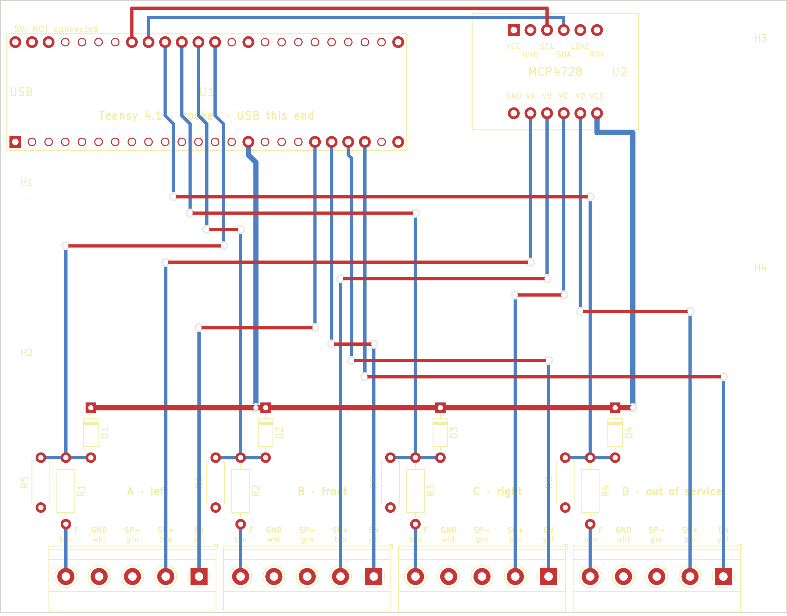

# Carrier board (v1)

Replaces the breadboard: Teensy 4.1 and the MCP4728 DAC plug into sockets, each cable module gets one 5-way screw terminal.
Same connections as `docs/diagrams/cabling-4-modules.png`, plus a protection network on each force input.

*Top view without the ground fill. Red = top copper, blue = bottom copper, yellow = silkscreen. Module wires enter at the bottom edge.*

## What is on it
| Part | Connects |
|---|---|
| U1 Teensy 4.1 (socket, USB at the left edge) | enable T27–30, force T14–17, I²C T18 SDA / T19 SCL, 3V3, GND. **VIN/5V not connected** |
| U2 Adafruit MCP4728 (socket) | VA–VD → setpoint of modules A–D, VCC 3.3 V from the Teensy |
| J1–J4 terminals, one per module (A left, B front, C right, D out of service) | 1 EN yellow · 2 SP+ blue · 3 SP− green · 4 GND white · 5 F brown |
| R1–R4 1 kΩ (series), R5–R8 1 MΩ (pull-down), D1–D4 BAT85 (clamp to 3.3 V) | per force input: terminal F → 1 kΩ → Teensy pin; 1 MΩ to GND; BAT85 to 3.3 V |

Board 120 × 93.5 mm, 2 layers, through-hole parts only, 0.5 mm tracks (0.8 mm for 3.3 V), 0.3 mm clearance, ground fill on both layers, 4 × M3 holes.

**Force inputs.** The IAA100 amplifiers are trimmed to 0–3.3 V = 0–200 N (`docs/knowledge/calibration.md`). With 1 kΩ / 1 MΩ the Teensy sees 99.9 % of that (no recalibration needed). An unplugged input reads 0 N, as the ground jumpers do today. The diode only acts on a fault (amplifier mis-set or miswired): the 1 kΩ limits the current, the BAT85 dumps it into 3.3 V. If an amplifier can only be set to 0–10 V, change the pair to a divider (e.g. 22 kΩ series / 10 kΩ pull-down → 3.1 V) and recalibrate.

## Order (PCB maker)
1. Upload `fab/bumpem-carrier-gerbers.zip` to JLCPCB, Aisler, PCBWay or similar. Defaults are fine: 2 layers, 1.6 mm, any colour, HASL. The design uses no tight rules (smallest drill 0.8 mm).
2. Buy the parts below (or ask the makerspace for them).

| Qty | Part | Note |
|---|---|---|
| 1 | PCB from step 1 | |
| 2 | female header 1 × 24, 2.54 mm, 8.5 mm tall | Teensy socket (or cut from 1 × 40 strips) |
| 2 | female header 1 × 6, 2.54 mm | DAC socket |
| 4 | Phoenix Contact MKDS 1,5/5-5,08 (1715747) | or any 5-way 5.08 mm PCB screw terminal with the same footprint |
| 4 | resistor 1 kΩ, 0.25 W, 1 %, axial | R1–R4 |
| 4 | resistor 1 MΩ, 0.25 W, 1 %, axial | R5–R8 |
| 4 | BAT85 Schottky diode, DO-35 | D1–D4, band (cathode) towards the 3.3 V track |
| 4 | M3 spacer + screw | |

Full list: `fab/bumpem-carrier-bom.csv`. Schematic: `fab/bumpem-carrier-schematic.pdf`. Layout print: `fab/bumpem-carrier-layout.pdf`.

## Assembly and first power-up
1. Solder the low parts first: resistors, diodes (check the band!), then the female headers, then the terminals (wire openings facing the board edge).
2. **No Teensy, no DAC, no modules.** Multimeter beep test: 3V3 ↔ GND must **not** beep; each terminal pin 3 and 4 ↔ Teensy GND must beep; terminal A pin 1 ↔ Teensy socket pin 27 must beep (same for B–D: 28, 29, 30).
3. Plug in the DAC and the Teensy (USB at the board edge). USB only, no modules: `bumpem info --port <PORT>` must answer.
4. Move the module wires from the breadboard to the terminals one module at a time, 48 V off, colours as printed on the board. Then repeat `scripts/open_loop_test.sh` for that module.

## Before ordering: check in KiCad (5 minutes)
- Open `bumpem-carrier.kicad_pro` → PCB editor → View → 3D viewer: the terminal wire openings must face the bottom board edge.
- Hold a Teensy and the DAC over a 1:1 print of `fab/bumpem-carrier-layout.pdf`: pins over the holes, Teensy USB at the left edge.

## Change the design
Do not edit the KiCad files by hand; they are generated.
- Connections and part values: `netlist.py`. Placement and routing: `gen_carrier.py`. Schematic drawing: `gen_schematic.py`.
- Rebuild and check everything: `./build.sh` (needs KiCad 8). It must print 0 ERC violations and 0 DRC / schematic-parity violations.

Sources: Teensy 4.1 pin order from XenGi/teensy_library (MIT); MCP4728 breakout pad positions from adafruit/Adafruit-MCP4728-PCB; pins from `firmware/src/main.ino` and `docs/knowledge/wiring.md`.
